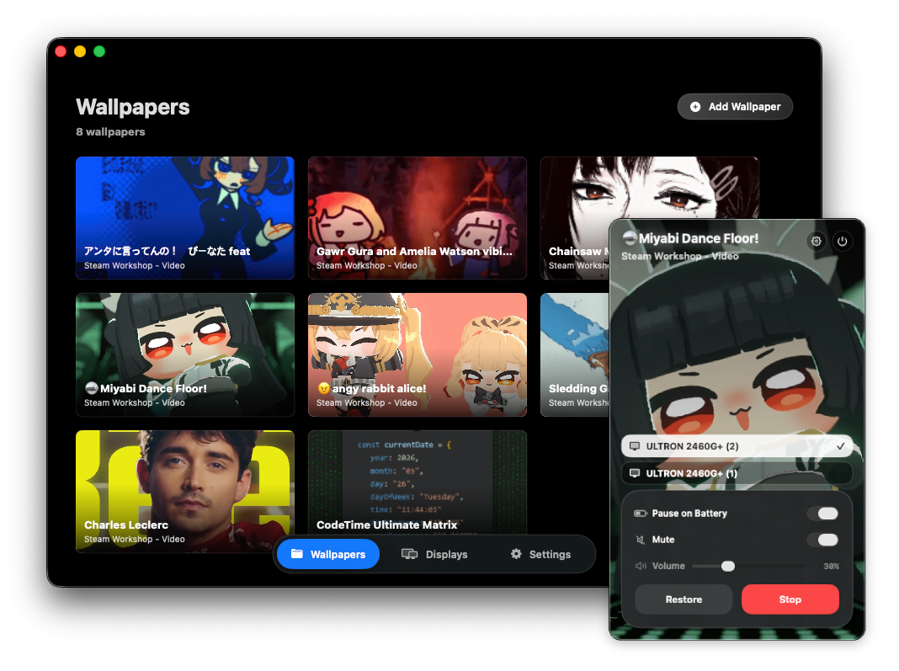

<p align="center">
  
</p>
<h1 align="center">LivePaper</h1>


LivePaper is a local-first macOS live wallpaper app. It runs from the menu bar, keeps your normal macOS desktop wallpaper untouched, and renders animated wallpapers behind your windows using native AppKit, AVFoundation, and WebKit.

> Current status: early local MVP. It is built for personal use and development, not notarized distribution.


## Features

- Menu bar utility app with a compact wallpaper control panel.
- Local video wallpapers for `.mp4`, `.mov`, `.m4v`, and `.mkv` files.
- Web wallpaper support, including normalized YouTube embed URLs where possible.
- Steam Workshop import path for supported Wallpaper Engine web/video wallpapers.
- Per-display wallpaper assignment and restore.
- Playback controls for mute, volume, scale mode, pause on battery, pause on fullscreen, and mute on fullscreen.

## Supported Wallpaper Types

LivePaper currently supports:

- Local video files.
- Web pages rendered through `WKWebView`.
- Wallpaper Engine Workshop items that resolve to web wallpapers or video files.

Not supported:

- Wallpaper Engine scene wallpapers.
- Wallpaper Engine application wallpapers.
- Package-only Workshop items without a directly importable web or video entry point.
- Lock Screen or Screen Saver integration.

YouTube and other embedded media can be limited by autoplay, audio, and embed policy restrictions inside `WKWebView`. If a web wallpaper refuses to play reliably, use a local video file instead.

## Requirements

- macOS with the project deployment target available. The current Xcode project target is macOS `26.5`.
- Xcode installed at `/Applications/Xcode.app`.
- Optional: SteamCMD for Steam Workshop downloads.

For Steam Workshop downloads, install SteamCMD and make sure it can run in Terminal first:

```bash
steamcmd +quit
```

Some Workshop items require an authenticated Steam account session. LivePaper can use SteamCMD account-session mode, but the actual Steam Guard/login flow should be completed in Terminal first.

## Build

Build without signing for local verification:

```bash
DEVELOPER_DIR=/Applications/Xcode.app/Contents/Developer \
xcodebuild \
  -project LivePaper.xcodeproj \
  -scheme LivePaper \
  -configuration Debug \
  -derivedDataPath .build/DerivedData \
  CODE_SIGNING_ALLOWED=NO \
  build
```

Run the debug build:

```bash
open .build/DerivedData/Build/Products/Debug/LivePaper.app
```

## Project Layout

```text
LivePaper/
  LivePaperApp.swift              menu bar app entry point and main window handling
  ContentView.swift               main SwiftUI shell
  Core/                           persisted settings, content models, Steam/YouTube helpers
  Features/                       UI-facing coordinator, tabs, add-wallpaper flows
  Runtime/                        AppKit wallpaper windows and playback/runtime controllers
  SharedUI/                       reusable SwiftUI components and first-launch intro
  Assets.xcassets/                app icon and menu bar icon assets

LivePaperTests/                   unit tests for runtime policy, settings, import helpers, etc.
DesignPreview/                    source logo/icon preview assets
```

## Development Principles

- Local-first: no account requirement, cloud library, analytics, or tracking.
- Native macOS runtime: AppKit windows, AVFoundation video playback, and WebKit for web wallpapers.
- Keep the user's macOS desktop wallpaper untouched; stopping LivePaper should reveal the existing wallpaper.
- Keep runtime behavior behind coordinator/runtime boundaries so the implementation can evolve without rewriting the UI.
