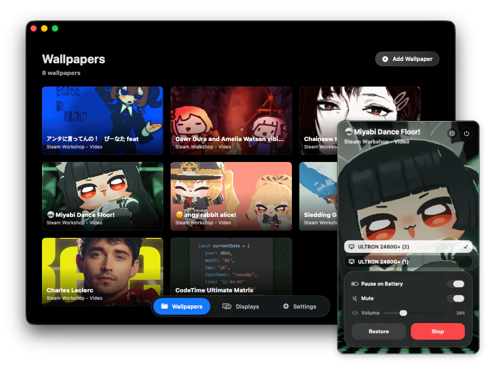

<p align="center">
  
</p>
<h1 align="center">LivePaper</h1>


LivePaper is a local-first macOS live wallpaper app. It runs from the menu bar, keeps your normal macOS desktop wallpaper untouched, and renders animated wallpapers behind your windows using native AppKit, AVFoundation, and WebKit.

> Current status: early local MVP. It is built for personal use and development, not notarized distribution.


## Features

- Menu bar utility app with a compact wallpaper control panel.
- Local video wallpapers for `.mp4`, `.mov`, `.m4v`, and `.mkv` files.
- Web wallpaper support, including normalized YouTube embed URLs where possible.
- Steam Workshop import path for supported Wallpaper Engine web/video wallpapers.
- Music Sync wallpapers for Apple Music and Spotify now-playing album art, with automatic source selection.
- Per-display wallpaper assignment, display restore, and display hotplug recovery.
- Optional same-video synchronization across displays.
- Experimental Lock Screen export for video wallpapers through macOS Aerial wallpaper assets.
- Video-only Screen Saver companion bundle.
- Apply status indicators for Desktop, Lock Screen, and Screen Saver updates.
- First-launch intro with Launch at Login setup.
- Runtime controls for mute, volume, audio display, scale mode, pause on battery, pause on fullscreen, and mute on fullscreen.
- Pause keeps the LivePaper surface in place and reveals the existing macOS wallpaper only when the runtime is stopped or unavailable.

## Supported Wallpaper Types

LivePaper currently supports:

- Local video files.
- Web pages rendered through `WKWebView`.
- Wallpaper Engine Workshop items that resolve to web wallpapers or video files.
- Apple Music and Spotify album-art sync wallpapers.
- Lock Screen export for local video wallpapers and Wallpaper Engine Workshop video wallpapers.
- Screen Saver playback for local video wallpapers and Wallpaper Engine Workshop video wallpapers.

Not supported:

- Wallpaper Engine scene wallpapers.
- Wallpaper Engine application wallpapers.
- Package-only Workshop items without a directly importable web or video entry point.
- Lock Screen export for web, music, scene, application, or package-only wallpapers.
- Screen Saver playback for web, music, scene, application, or package-only wallpapers.

YouTube and other embedded media can be limited by autoplay, audio, and embed policy restrictions inside `WKWebView`. If a web wallpaper refuses to play reliably, use a local video file instead.

## Music Sync

Music Sync renders the currently playing album artwork as a wallpaper. It supports Apple Music and Spotify, with `Auto` as the default source mode. Auto checks both apps, picks the one that is currently playing, and keeps the last active source while playback is paused.

- Ambient: large blurred artwork background with track details and progress.
- Focus: stronger cover emphasis with reduced background motion.
- Minimal: compact text and progress treatment.

LivePaper polls now-playing metadata locally through AppleScript. In Auto mode, it checks lightweight metadata for both apps and fetches artwork only for the selected source. macOS may ask for Automation permission for Apple Music or Spotify. If permission is denied, Music Sync stays on its waiting state until access is restored.

Album artwork is cached under `~/Library/Application Support/LivePaper/MusicArtwork`. The desktop surface stays local; there is no analytics, account system, or remote LivePaper service involved.

## Runtime Behavior

LivePaper creates one desktop-level wallpaper window per active display. Video wallpapers use `AVQueuePlayer`, `AVPlayerLooper`, and `AVPlayerLayer`; web wallpapers use `WKWebView`; music wallpapers use native AppKit views backed by now-playing metadata.

For matching video wallpapers, LivePaper can share one playback group across displays so the same video stays in sync. The audio owner can be selected separately from the active display set.

Runtime policy currently handles:

- Restoring saved wallpapers on launch.
- Reconciling sessions when displays are added, removed, or rearranged.
- Pausing on battery when enabled.
- Pausing or muting displays covered by fullscreen apps when enabled.
- Keeping pause visually stable without switching the user's macOS desktop wallpaper.

## Apply Status

The bottom control strip shows whether the current wallpaper has been applied to the desktop, exported to the Lock Screen, and written to the Screen Saver configuration. Each surface reports one of these states:

- Applying: LivePaper is updating that surface.
- Applied: the surface was updated or restored successfully.
- Skipped: the surface is not eligible or automatic export is disabled.
- Failed: LivePaper could not verify or complete the update.

Status is refreshed when the main window appears and when the app becomes active, so it can reflect external macOS wallpaper store changes after returning to LivePaper.

## Lock Screen Export

LivePaper can export supported video wallpapers to the macOS Lock Screen. When `Settings > Lock Screen > Apply with Wallpaper` is enabled, pressing `Apply This Wallpaper` also exports the same video to macOS's Aerial wallpaper asset store for each selected display. The wallpaper detail view also has a lock button for manually exporting a supported video to the selected displays.

Only video-backed wallpapers are eligible for automatic Lock Screen export. Web wallpapers can still run on the desktop inside LivePaper, but they are not converted into Lock Screen assets.

This feature supports:

- Local video wallpapers.
- Steam Workshop wallpapers imported as Wallpaper Engine `video` items.

This feature does not support web wallpapers, YouTube wallpapers, Music Sync wallpapers, scene wallpapers, application wallpapers, or package-only Workshop items.

The implementation patches the user-level macOS Aerial wallpaper manifest under `~/Library/Application Support/com.apple.wallpaper/aerials` and updates the wallpaper store selection. This is not a public Apple API surface, so it should be treated as experimental and may break after macOS updates.

## Screen Saver

LivePaper includes a video-only `.saver` companion bundle. The app stores the latest supported video wallpaper in `~/Library/Application Support/LivePaper/ScreenSaverConfig.json`, and the screen saver reads that file to play the same video with `AVPlayerLayer`.

Applying a supported video wallpaper automatically updates the screen saver configuration. The `.saver` bundle is installed separately because macOS screen savers must be selected from System Settings.

To use it:

1. Apply a local video wallpaper or a Steam Workshop wallpaper imported as a Wallpaper Engine `video` item.
2. Open `Settings > Lock Screen`.
3. Click `Install` in the `Screen Saver` row.
4. Open macOS Screen Saver settings and select `LivePaper Screen Saver`.

The screen saver intentionally does not support web wallpapers, YouTube wallpapers, Music Sync wallpapers, scene wallpapers, application wallpapers, or package-only Workshop items.

## Requirements

- macOS with the project deployment target available. The current Xcode project target is macOS `26.5`.
- Xcode installed at `/Applications/Xcode.app`.
- Optional: SteamCMD for Steam Workshop downloads.
- Optional: Apple Music or Spotify for Music Sync wallpapers.

For Steam Workshop downloads, install SteamCMD and make sure it can run in Terminal first:

```bash
steamcmd +quit
```

Some Workshop items require an authenticated Steam account session. LivePaper can use SteamCMD account-session mode, but the actual Steam Guard/login flow should be completed in Terminal first.

## Install From DMG

Download the latest `LivePaper-<version>-<build>.dmg` from GitHub Releases, open it, and drag `LivePaper.app` into `Applications`.

Current release builds are intended for personal/internal use and are not notarized. If macOS blocks the app because it was downloaded from the internet, remove the quarantine attribute after installing:

```bash
xattr -dr com.apple.quarantine /Applications/LivePaper.app
open /Applications/LivePaper.app
```

If you install to the user Applications folder instead:

```bash
xattr -dr com.apple.quarantine ~/Applications/LivePaper.app
open ~/Applications/LivePaper.app
```

## Build

Build without signing for local verification:

```bash
DEVELOPER_DIR=/Applications/Xcode.app/Contents/Developer \
xcodebuild \
  -project LivePaper.xcodeproj \
  -scheme LivePaper \
  -configuration Debug \
  -derivedDataPath .build/DerivedData \
  CODE_SIGNING_ALLOWED=NO \
  build
```

Run the debug build:

```bash
open .build/DerivedData/Build/Products/Debug/LivePaper.app
```

## Project Layout

```text
LivePaper/
  LivePaperApp.swift              menu bar app entry point and main window handling
  ContentView.swift               main SwiftUI shell
  Core/                           persisted settings, content models, Steam/YouTube helpers
  Features/                       UI-facing coordinator, tabs, add-wallpaper flows
  Runtime/                        AppKit wallpaper windows and playback/runtime controllers
  SharedUI/                       reusable SwiftUI components and first-launch intro
  Assets.xcassets/                app icon and menu bar icon assets
LivePaperScreenSaver/             bundled video-only macOS screen saver

LivePaperTests/                   unit tests for runtime policy, settings, import helpers, etc.
DesignPreview/                    source logo/icon preview assets
```

## Development Principles

- Local-first: no account requirement, cloud library, analytics, or tracking.
- Native macOS runtime: AppKit windows, AVFoundation video playback, and WebKit for web wallpapers.
- Keep the user's macOS desktop wallpaper untouched; stopping LivePaper should reveal the existing wallpaper.
- Keep runtime behavior behind coordinator/runtime boundaries so the implementation can evolve without rewriting the UI.
- Prefer small, reversible runtime changes with tests around display policy, pause behavior, import parsing, and settings persistence.
